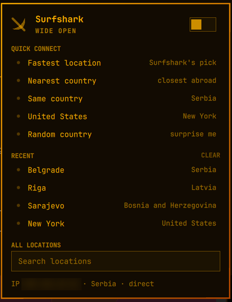
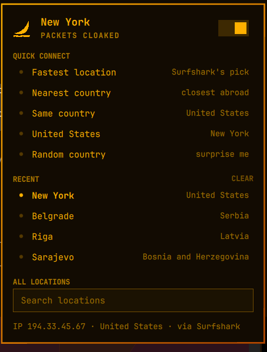
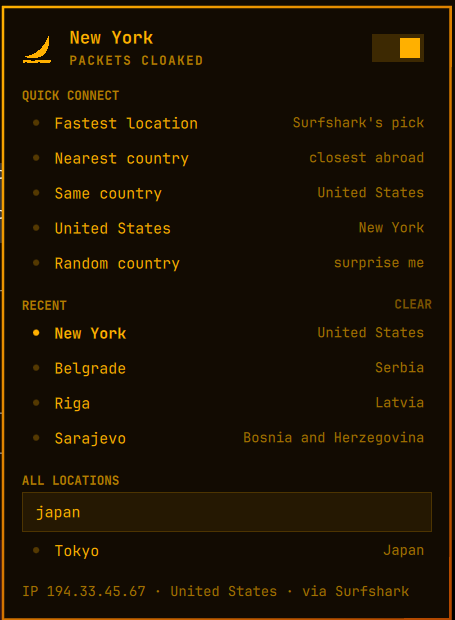
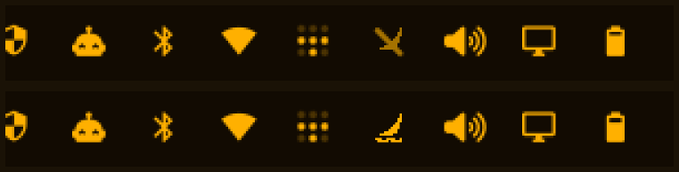

<div align="center">

# Surfshark for the Omarchy bar

**On/off in the bar, quick jumps to the fastest, nearest, local, US or a random
location, your recent locations, and a search across every location your account
has.**

Built for the [Omarchy](https://omarchy.org) shell. It drives the **official
Surfshark client's own daemon**, so the app and the bar never disagree and there
is no second VPN tunnel fighting the first one over routing. It needs no elevated
privileges at all: no setuid helper, no extra system service, and nothing that
ever prompts you for a password.

[Install](#install) &nbsp;&middot;&nbsp; [First run](#first-run-connect-once-through-the-app) &nbsp;&middot;&nbsp; [Using it](#using-it) &nbsp;&middot;&nbsp; [How it works](#how-it-works) &nbsp;&middot;&nbsp; [Report a bug](../../issues/new)

[](../../stargazers)
[](LICENSE)
[](../../commits/main)
[](../../issues)

[](https://buymeacoffee.com/nenadjokic)
[](https://paypal.me/nenadjokicRS)



</div>

> **Unofficial.** This project is not affiliated with, endorsed by, or supported
> by Surfshark. It talks to a private, undocumented IPC socket belonging to the
> official Linux client, so a client update can change or remove it at any time.
> You need your own Surfshark subscription; this does not bypass one.

## Requirements

- Omarchy with the Quickshell-based shell (`omarchy plugin` available)
- The official Surfshark Linux client, installed **and logged in**
  (`surfshark-client` on the AUR)
- NetworkManager (the client uses it to bring the tunnel up)
- `python3` — standard library only, no packages to install

## Install

```sh
omarchy plugin add https://github.com/nenadjokic/omarchy-surfshark.git --enable
omarchy bar move nenadjokic.surfshark --after omarchy.network
omarchy restart shell
```

The last step matters: a new bar widget is **not** picked up by hot-reload, only
by a shell restart.

Place it wherever you like — `--after <some-other-widget-id>` or
`--section right --index N`. Note `omarchy bar move` has no `--before`; it will
print "Moved" and do nothing.

## First run: connect once through the app

Open the Surfshark app and connect once, to any location. Then the widget is
ready and you can use it for everything afterwards.

This one step cannot be automated away. The account's WireGuard private key is
generated by the app and stored in `safe-storage.json`, encrypted with Electron's
safeStorage against your system keyring, so it cannot be read from outside the
app. Connecting once puts that key into the NetworkManager profile the client
creates, and the widget copies it from there into
`~/.config/omarchy-surfshark/wg.key` (mode `0600`) the next time it polls.

Until that has happened the panel says **NOT SET UP** and tells you what is
missing, rather than failing silently.

## Using it

**In the bar:** left click opens the panel, right click toggles the VPN, middle
click refreshes.

**In the panel:**

| Row | What it does |
| --- | --- |
| **Fastest location** | Surfshark's own suggestion — the same server the app's Quick Connect would choose |
| **Nearest country** | The geographically closest server **abroad** |
| **Same country** | The least loaded server in the country you are in now |
| **United States** | A US exit; New York by default, configurable |
| **Random country** | A random country you are not already in |
| **Recent** | Reconnect to somewhere you have been; `CLEAR` empties the list |
| **All locations** | Search every location by city, country or country code |

<div align="center">

| Connected | Searching |
| --- | --- |
|  |  |

The bar icon, tunnel down and tunnel up:



</div>

Two of these are opinionated on purpose:

- **Nearest skips your own country.** Otherwise, any time your country has a
  server, "Nearest country" returns exactly what "Same country" returns and two
  rows do the same job.
- **Random picks a country first, then a server in it.** Picking a server
  straight out of the pool would surface countries with twenty-odd exits (the
  US, Germany) far more often than one-exit countries — that is random by
  server, not by country.

### Keyboard

Inside the panel:

| Key | Action |
| --- | --- |
| `t` | toggle the VPN |
| `f` | fastest |
| `n` | nearest |
| `s` | same country |
| `u` | United States |
| `x` | random country |
| `r` | refresh state |
| `/` | focus the search field |
| `esc` | first clears the query, then leaves the field |

In the search field every letter is text — arrows navigate, `enter` connects to
the first hit. (Some panels bind `j`/`k` to navigation inside their search box;
that is unusable for a country list, where `j` is Japan and `k` is Kenya.)

### Reading the state

The hero line rotates through phrases for the current state — `WIDE OPEN`,
`DIGGING THE TUNNEL`, `TUNNEL HOLDING` — the way Omarchy's network panel rotates
"Wiring bits / Handling packets". Every phrase in a set means the same thing, so
the state stays readable as the text changes.

The two places that never editorialise:

- the **bar tooltip**: `Protected · New York, United States`, or
  `Not protected · Serbia`
- the **bottom line**: `IP <address> · <country> · via Surfshark` — or `· direct`
  when the tunnel is down. The country is whatever your *current* public IP
  resolves to, so with the tunnel up it is the exit server's country.

## Settings

Configure through Omarchy's widget settings, or with `omarchy bar set`:

| Key | Default | Meaning |
| --- | --- | --- |
| `refreshIntervalSec` | `20` | how often the state is polled |
| `usLocation` | `us-nyc.prod.surfshark.com` | which exit the "United States" row targets |

```sh
omarchy bar set nenadjokic.surfshark usLocation us-lax.prod.surfshark.com
```

Use `omarchy-surfshark list united` to find the hostname you want. The row's
label follows the setting, so it will read "Los Angeles".

## Command line

The backend is usable on its own — handy for keybinds and scripts:

```sh
P=~/.config/omarchy/plugins/nenadjokic.surfshark/bin/omarchy-surfshark

$P status              # JSON state
$P on / off
$P fastest / nearest / same / random
$P usa [hostname]
$P connect us-nyc.prod.surfshark.com
$P list [filter]       # every server, with load
$P locations           # same, as JSON
$P recent [n]
$P recent-clear        # undoable
$P recent-restore
$P key-import          # force the key copy
$P state               # raw daemon state, for debugging
```

Bind them in `hypr/bindings.conf` if you want, or drive the widget over IPC:

```sh
qs -p /usr/share/omarchy/shell ipc call nenadjokic.surfshark fastest
qs -p /usr/share/omarchy/shell ipc call nenadjokic.surfshark toggle
```

## How it works

Surfshark's Linux client has no CLI, which is why most attempts at this end up
building a *second* WireGuard tunnel from the public API — with a root helper and
a manually downloaded config. That works until both tunnels are up at once.

But the app does not bring the tunnel up itself. Two daemons ship with it:

| Unit | Runs as | Socket | Role |
| --- | --- | --- | --- |
| `surfsharkd.service` (user) | you | `/run/user/<uid>/surfsharkd.sock` | brings the tunnel up via NetworkManager |
| `surfsharkd2.service` (system) | root | `/run/surfshark/surfsharkd2.sock` | kill switch / firewall |

Both sockets are mode `0666`, so the user daemon needs no privileges. They are
`gjs` processes that sit on the system bus but own no well-known name — the
socket is not D-Bus. It is newline-delimited JSON:

```
{"method": "...", "params": [...]}\n
-> {"type":"result","value":...}
-> {"type":"error","value":{"name":...,"message":...,"code":...}}
```

The user daemon's methods, found by probing (its errors name a missing parameter
one at a time, which makes them a very good oracle):

```
getState()                                NetworkManager + tunnel state
connect(kind)                             kind is "wg" or "openvpn"
disconnect(kind)
addConnection(kind, {domain, pub, priv})  defines the NM profile
removeConnection(kind)
version()
```

Switching servers is `addConnection` followed by `connect`.

The **server list and the location picks come from the app's own cache**, not
from a separate API call: `~/.config/Surfshark/cache.json` holds
`/v5/server/clusters/all` (every cluster with its `connectionName`, `pubKey`,
coordinates and load) alongside `/v5/server/suggest?limit=1`, which is what the
app calls Quick Connect. Recents are merged with the app's own `recents` from
`settings-<account>.json`, so the list is the same no matter where a connection
was started from.

## What it trusts

There is a private key in this directory, so none of the inputs get the benefit
of the doubt.

**Nothing is read without a limit.** The geo response, the Surfshark app's own
cache, the daemon's replies on the unix socket and this plugin's own files are
all read through a hard byte cap that is checked *before* the bytes are parsed —
256 KiB for the geo response, 16 MiB for the app cache (a full server list is
about 120 KB), 4 MiB for one daemon reply. Anything past the cap is refused
rather than truncated.

**Paths cannot be redirected.** `~/.config/omarchy-surfshark` is opened one
component at a time with `O_NOFOLLOW` and verified to be a directory owned by
you; it is tightened to `0700` in place if it is not, since a mode handed to
`makedirs` does nothing to a directory that already exists. Files are opened
relative to that descriptor instead of by walking a path a second time, and
writes land in a randomly named temporary created `O_EXCL | O_NOFOLLOW` at
`0600`, published with a descriptor-relative rename. A symlink planted at
`wg.key` is replaced, never followed and never written through.

**The geo lookup stays on its own host.** `api.surfshark.com` answering with a
redirect somewhere else is refused rather than followed; the same-host
http→https upgrade still works.

**Everything it displays is drawn as text.** The public IP and country come off
the network, the location and country names out of the app's cache, and the
error line is the daemon's own message. Every `Text` element is pinned to
`Text.PlainText`, and the two places the shell draws rather than this widget —
the panel hero and the bar tooltip — get a string with markup and control
characters stripped first. Nothing that arrives from outside can be promoted to
rich text inside the shell process.

## Files it writes

Everything lives in `~/.config/omarchy-surfshark/`, which is created `0700`:

| File | Contents |
| --- | --- |
| `wg.key` | the account's WireGuard private key, mode `0600` |
| `recent.json` | locations connected to from the widget |
| `hidden.json` | entries suppressed by `CLEAR` |
| `current` | the last host connected to |

Every file is written `0600`. Nothing is sent anywhere except Surfshark's own
endpoints: the daemon socket on your machine, and
`api.surfshark.com/v1/server/user` to learn your current public IP and country.

## Troubleshooting

**Panel says NOT SET UP.** Check that `~/.config/omarchy-surfshark/wg.key`
exists. If it does not, connect once through the Surfshark app and wait one poll,
or run `omarchy-surfshark key-import`.

**Panel says the daemon is not running.** Start the Surfshark app once, or
`systemctl --user start surfsharkd`.

**The app's own window does not show a connection the widget made.** Expected —
the app tracks its own session state and does not watch the daemon for changes
made elsewhere. The tunnel is genuinely up; check the bottom line of the panel or
`omarchy-surfshark status`.

**A new widget does not appear in the bar.** Hot-reload does not create bar
widget instances. `omarchy restart shell`.

**Something is off and there is no error.** Real QML errors only show up in
`journalctl --user -t omarchy-shell`.

## Uninstall

```sh
omarchy plugin remove nenadjokic.surfshark
rm -rf ~/.config/omarchy-surfshark
omarchy restart shell
```

Removing the plugin does not touch the Surfshark client or any tunnel it set up.

## Support the developer

This widget is free, with no ads and no tracking. If it earns a place in your
bar, a coffee genuinely helps and means a lot.

<div align="center">

[](https://buymeacoffee.com/nenadjokic)
&nbsp;
[](https://paypal.me/nenadjokicRS)

</div>

---

## License

MIT — see [LICENSE](LICENSE).
